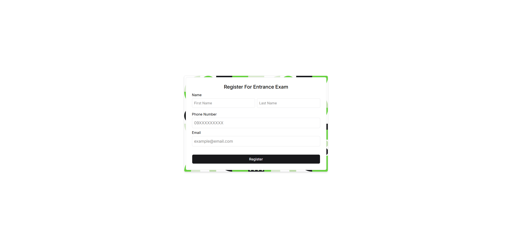
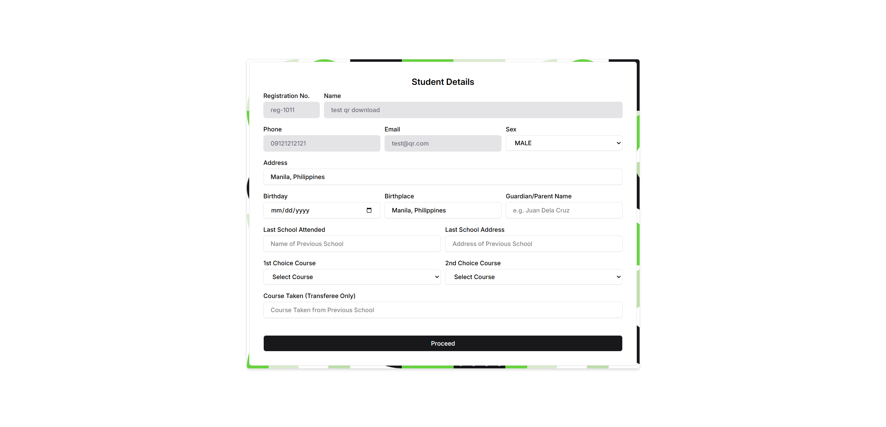
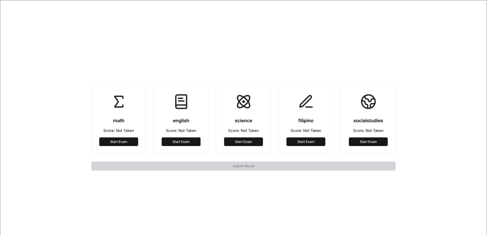
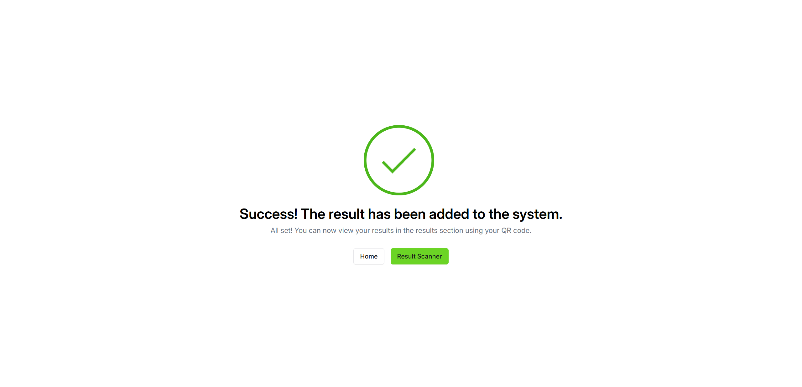
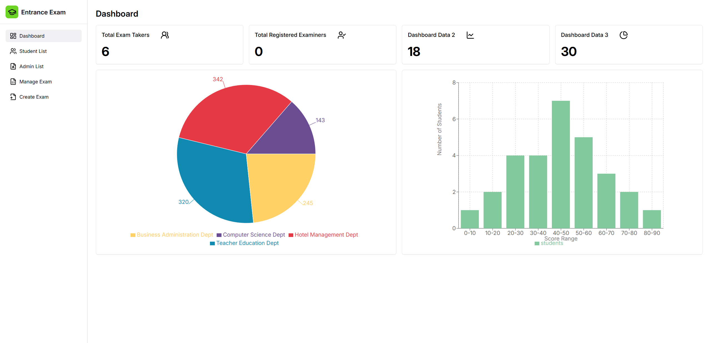

# Entrance Exam System  

An online examination platform developed to streamline the entrance exam process. The system allows students to register, take exams, and retrieve their results through a QR code. It aims to replace manual exam handling with a faster, more reliable, and paperless solution.  

## Key Features  

- Student registration and account creation  
- Online exam management  
- Automatic scoring and result generation  
- QR code-enabled results retrieval  
- Clean and user-friendly interface  

## Tech Stack  

- **Frontend:** React, Tailwind CSS  
- **Backend:** Node.js, Express  
- **Database:** MongoDB  

## UI Overview  

  
    

  

  
    

  

  
    

  

  
    

  

  
    

 

